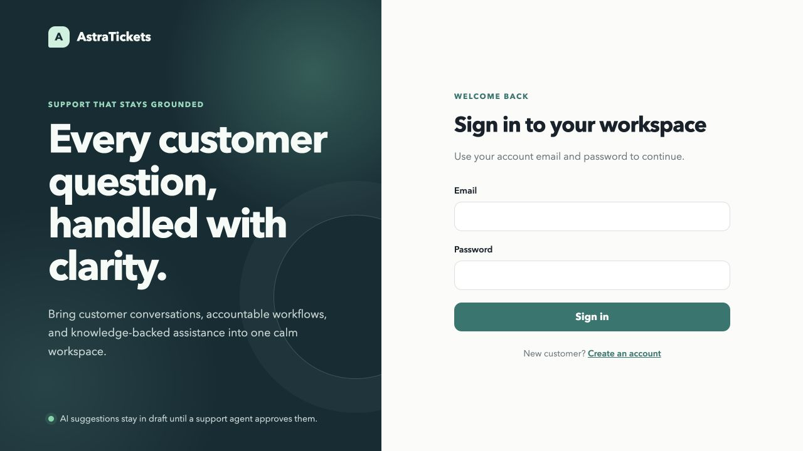

# AstraTickets
> AI-Powered Customer-Support Ticketing System

AstraTickets brings customer requests, support conversations, and AI-assisted
answers into one workspace. Customers can create and follow tickets, while support
teams manage assignments, status changes, replies, and grounded AI drafts with
source references.

## Demo

[Watch the AstraTickets demo](https://youtu.be/TqRiW8OkLdo)

[Open the deployed AstraTickets app](https://astratickets.onrender.com/)



## Highlights

- Full-stack customer-support platform with React, FastAPI, and SQLAlchemy
- JWT authentication with customer, agent, and administrator roles
- Ticket creation, updates, deletion, assignment, replies, and status workflows
- Separate customer dashboard and staff support queue
- Local semantic retrieval with SentenceTransformers and ChromaDB
- Grounded AI reply drafts with knowledge-base citations
- Automatic refusal when the knowledge base does not contain enough information
- Administrator tools for staff accounts and knowledge documents
- Alembic database migrations and backend API tests

## Product Experience

### Customer Workspace

Customers can register, submit support tickets, choose a priority, follow each
ticket's status, and continue the conversation with the support team. Customer
accounts can see only their own requests and replies.

### Staff Workspace

Agents work from a shared support queue with status and priority filters. They can
claim unassigned tickets, reply to customers, update ticket status, and release work
back to the queue. AI suggestions remain editable drafts until a staff member
reviews and sends them.

### Administrator Tools

Administrators can manage ticket assignments, create staff accounts from the
server, and add trusted `.txt` or `.md` documents to the knowledge base. A retrieval
preview shows the source text, relevance score, and search latency before the
content is used for AI-assisted replies.

## Architecture

```text
Customer or staff browser
  -> React and TypeScript interface
  -> FastAPI application
  -> JWT authentication and role checks
  -> SQLAlchemy ticket and conversation data

Support ticket conversation
  -> SentenceTransformer query embedding
  -> Local ChromaDB knowledge retrieval
  -> Evidence threshold check
  -> OpenAI-compatible answer generation
  -> Citation validation
  -> Staff review and manual send
```

The application keeps normal ticket workflows separate from AI assistance.
FastAPI and SQLAlchemy control users, tickets, assignments, and replies. The RAG
pipeline retrieves local knowledge and supplies only relevant evidence to the
generation service. The resulting answer must cite valid sources before it can be
shown as a staff draft.

## Tech Stack

| Area | Tools |
| --- | --- |
| Frontend | React, Vite, TypeScript |
| Backend API | FastAPI, Pydantic |
| Database | SQLAlchemy, Alembic, SQLite |
| Authentication | JWT, Argon2 |
| Embeddings | SentenceTransformers, all-MiniLM-L6-v2 |
| Vector storage | ChromaDB |
| Answer generation | OpenAI-compatible chat-completion API |
| Testing | Pytest, FastAPI TestClient |

## Grounded AI Replies

The AI assistant uses the latest customer message for retrieval and receives the
complete ticket conversation as context. Retrieved chunks include their document
title, source, chunk identifier, and similarity score.

If relevant evidence is available, the generated draft must cite the numbered
sources used in the answer. Missing citations and invented source numbers are
rejected. If retrieval does not find strong enough evidence, generation stops and
the ticket is returned to the support agent for a manual response.

AI drafts are never sent automatically.

## Role-Based Access

| Role | Access |
| --- | --- |
| Customer | Create tickets, view personal tickets, and reply to personal conversations |
| Agent | View the support queue and manage assigned tickets |
| Administrator | Manage all tickets, assignments, staff access, and knowledge documents |

Public registration creates customer accounts only. Staff access is created through
the secured backend command so a visitor cannot register as an agent or
administrator.
